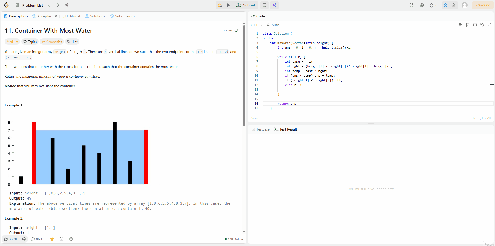

# What is this project
A Chrome extension that detects accepted submissions on LeetCode and provides time and space complexity analysis through OpenAI.
# How does it work
1. The extension observes DOM changes on /submissions/ pages.
2. When "Accepted" is detected, a confirmation popup appears.
3. If confirmed, the code is extracted from the page and sent to OpenAI API.
4. Analysis is displayed in a floating panel.
# Installation
1. Clone this repository
```
git clone https://github.com/jvarCS/BetterSolutionsLC.git
```
2. Add the extension to Chrome
   - Go to
   ```
    chrome://extensions/
   ```
   - Enable `developer mode`
   - Click on `load unpacked`
   - Select the project folder
# Pre-req
You've installed the extension. Nice work. You have to make one quick change before you can use it though.\
In `background.js` at the top, there is a line for an OpenAI key
```
chrome.runtime.onInstalled.addListener(() => {
  chrome.storage.local.set({
    openaiKey: "your-key"
  });
  console.log("API key stored");
});
```
Replace `your-key` with your actual OpenAI api key.\
\
Then, go back to
 ```
 chrome://extensions/
 ```
and refresh the extension. Now its ready to be used.
# Usage
The extension is setup and its time to use it. Do so by going on LeetCode and solving problems. You'll be prompted for analysis upon accepted submissions. 
# Areas for improvement
### API fee
Currently the analysis depends on the OpenAI api. This means there will eventually be a fee associated with your api key if you use it enough, though it would take a while to accumulate even a dollar.\
\
Fix for this would be to include a local llm option to avoid the fee all together and improve privacy as a bonus.
### Better analysis
The current analysis looks at your code's time and space complexity and gives a short description for each and for your code in general. More in-depth analysis could see specific suggestions be included to optimize parts of your code.
# Demo

